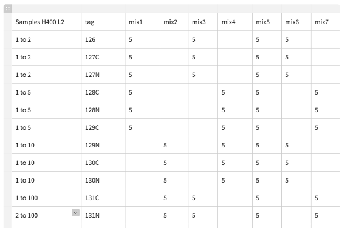

```{r global_options, echo=FALSE}
knitr::opts_chunk$set(fig.width=12,fig.height=8,warning=FALSE, message=FALSE,tidy = TRUE,tidy.opts=list(width.cutoff=50))
```

```{r setup, warning=FALSE, message=FALSE}
rm(list=ls())
library(tidyverse)
library(MSnbase)
library(camprotR)
library(ggplot2)
library(RColorBrewer)
library(knitr)
library(kableExtra)
library(VennDiagram)

source("../configs/functions.R")
```


# Reading PSM data

Two sample types were run on the mass spec:

**1. Using Heavy crosslinked and Light non-crosslinked sample**
From these samples, we tested:
* The optimal ratios between heavy and light for MS qualification accuracy
* The effects of label swabs
* The optimal parameters for Real time search, and the MS3 methods including FDR and Cuttoff methods
* The effects of label swabs

**2. Using Heavy and Light non-crosslinked samples**
* The effect of cycle duty length
* The optimal FAIMS parameters

The PD data from the MS runs of some methods were analysed by Cat, here is a link to an excel table the summarise the identification numbers of some of the methods.

# Experimental design
** sample 1**
   

**Sample 2**
Ratio | Tag
------------- | -------------
S1:1| 126
S1:1| 127N 
S1:5| 127C
S1:5|128N
S1:10|128C
S1:10|129C
S5:1|130C
S5:1|130N
S10:1|131C
S10:1|129N
**Sample 3**
Ratio | Tag
------------- | -------------
S1:1| 126
S1:1| 127N 
S1:5| 127C
S1:5|128N
S1:10|128C
S1:10|129N
S5:1|129C
S5:1|130N
S10:1|130C
S10:1|131N

We start by reading the files containing PSM level data. These files were searched for Light and heavy indenpendently on  from proteome discoverer 2.5.

```{r upload files}

infiles_heavy <- Sys.glob("../../raw_data/hyperplexed/110521/Heavy/*PSMs.txt")
infiles_light <- Sys.glob("../../raw_data/hyperplexed/110521/Light/*PSMs.txt")

intersecting <- intersect(basename(infiles_heavy),basename(infiles_light))

outersecting <- function(x){ 
  sort(c(setdiff(basename(infiles_heavy),basename(infiles_light)), setdiff(basename(infiles_light),basename(infiles_heavy))))}


infiles_heavy <- infiles_heavy[basename(infiles_heavy)%in%basename(infiles_light)]
infiles_light <- infiles_light[basename(infiles_light)%in%basename(infiles_heavy)]

names(infiles_heavy) <- gsub("_PSMs.txt$", "", basename(infiles_heavy))
names(infiles_light) <- gsub("_PSMs.txt$", "", basename(infiles_light)) 


infiles <- c(infiles_heavy, infiles_light)

file.names <- data.frame("Heavy"=sort(names(infiles_heavy)), "light"=sort(names(infiles_light)))
kable(file.names, caption = "") %>%
  kable_classic(full_width = F)
```
There are **26** files intersecting between heavy and light analysis which were kept for subsequent analysis. 6 files were not overlapping hence were excluded. 


# Parse features

The first step is to remove contaminant proteins. These were defined using the cRAP database. Below, we parse the cRAP fasta to extract the IDs for the cRAP proteins, in both ‘cRAP’ format and Uniprot IDs for these proteins.
```{r}

crap_fasta_inf <- system.file(
  "extdata", "cRAP_FullIdentifiers.fasta.gz", 
  package = "camprotR"
)

# Load the cRAP FASTA used for the PD search
crap.fasta <- Biostrings::fasta.index(crap_fasta_inf, seqtype = "AA")

# Define a base R version of stringr::str_extract_all()
# base R str_extract
str_extract_all <- function(pattern, string) {
  gregexpr(pattern, string, perl = TRUE) %>% 
    regmatches(string, .) %>% 
    unlist()
}

# Extract the non cRAP UniProt accessions associated with each cRAP protein
crap.accessions <- crap.fasta %>% 
  pull(desc) %>% 
  str_extract_all("(?<=\\|).*?(?=\\|)", .) %>% 
  unlist()
```

We run a loop to read the heavy and light PSM file using `parse_features` from [`camprotR`](https://github.com/CambridgeCentreForProteomics/camprotR)  which will remove features which may originate from contaminants, as well as features which don’t have a unique master protein.
```{r, message=F}


infiles_heavy <- infiles_heavy[names(infiles_heavy)!="CF_hyperplexTESTsample_FDR_CO_SPSMS3_Mix2"]
infiles_heavy <- infiles_heavy[names(infiles_heavy)!="CF_hyperplexTESTsample_FDR_CO_SPSMS3_Mix4"]
unfilt_heavy_psm <- NULL

for (i in infiles_heavy) {
  sample_name <- gsub("*_PSMs.txt","",basename(i))
  x<- parse_features(read.delim(i), TMT=TRUE, level="PSM", unique_master = TRUE, filter_crap = TRUE, crap_proteins = crap.accessions)
  x$sample <- sample_name 
  unfilt_heavy_psm[[sample_name]] <- x
}

infiles_light <- infiles_light[names(infiles_light)!="CF_hyperplexTESTsample_FDR_CO_SPSMS3_Mix2"]
infiles_light <- infiles_light[names(infiles_light)!="CF_hyperplexTESTsample_FDR_CO_SPSMS3_Mix4"]
unfilt_light_psm <- NULL

for (i in infiles_light) {
  sample_name <- gsub("*_PSMs.txt","",basename(i))
  x<- parse_features(read.delim(i), TMT=TRUE, level="PSM", unique_master = TRUE, filter_crap = TRUE, crap_proteins = crap.accessions)
  x$sample <- sample_name 
  unfilt_light_psm[[sample_name]] <- x
}

```
Two files were further excluded `CF_hyperplexTESTsample_FDR_CO_SPSMS3_Mix2_PSMs` and `CF_hyperplexTESTsample_FDR_CO_SPSMS3_Mix4_PSMs` because they contained empty values in the heavy folder. In total, there are **24** files in both pairs for the subsequent analysis

We then combine two lists of heavy and light labelled PSMs before converting in  **MSnsets** 
```{r}
names(unfilt_heavy_psm) <- paste0("Heavy_", names(unfilt_heavy_psm))
names(unfilt_light_psm) <- paste0("light_", names(unfilt_light_psm))


makeMsnset <- function(obj){
  
  abundance_cols <- colnames(obj)[grepl('Abundance.', colnames(obj))]
    
  psm_e <- as.matrix(obj[,abundance_cols])
  psm_f <- obj[,setdiff(colnames(obj), abundance_cols)]
    
  # update the column names to remove the 'Abundance.` prefix
  colnames(psm_e) <- gsub('Abundance.', '', colnames(psm_e))
    
  MSnbase::MSnSet(exprs=psm_e, fData=psm_f)
}
psm_res_light <- unfilt_light_psm %>% lapply(makeMsnset)
psm_res_heavy <- unfilt_heavy_psm %>% lapply(makeMsnset)

psm_res <- c(psm_res_heavy,psm_res_light)
```


Then we remove PSM features without quantification values
```{r}
psm_res <- psm_res %>% lapply(function(x){
  x <- x[rowSums(!is.na(exprs(x)))>0, ]
  camprotR:::message_parse(fData(x), 'Master.Protein.Accessions', "features without quantification removed")
  x  
})

psm_res_heavy <- psm_res_heavy %>% lapply(function(x){
  x <- x[rowSums(!is.na(exprs(x)))>0, ]
  x  
})

psm_res_light <- psm_res_light %>% lapply(function(x){
  x <- x[rowSums(!is.na(exprs(x)))>0, ]
  x  
})
```

Then we plot venn diagrams for the intersection between heavy and light 
```{r}
for (i in seq(psm_res_heavy)) {
  for (n in seq(psm_res_light)) {
   venn.diagram(
  x = list(fData(psm_res_heavy[[i]])$Master.Protein.Accessions, fData(psm_res_light[[n]])$Master.Protein.Accessions),
  category.names = c("Heavy" , "Light"),
  filename = paste0("../results/venn/Venndiagran for protein overlap between ", gsub("Heavy_","",names(psm_res_heavy)[i]), ".png"),
  main = gsub("Heavy_","",names(psm_res_heavy)[i]),
  col=c("#440154ff", '#21908dff'),
  fill = c(alpha("#440154ff",0.3), alpha('#21908dff',0.3)),
  fontfamily = "sans",
  cat.fontfamily = "sans",
  main.fontfamily = "sans",
  cat.col = c("#440154ff", '#21908dff'),
  margin = 0.05,
  cat.pos = c(-140, 140),
  cat.dist = c(0.05, 0.05),output =TRUE
)
  }
}

```


save PSM set
```{r}
saveRDS(psm_res, "../results/psm/psm_raw_LOPIT.rds")
```

